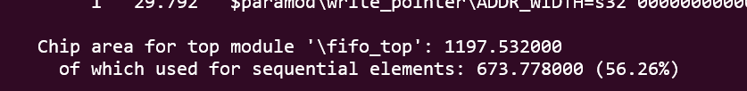
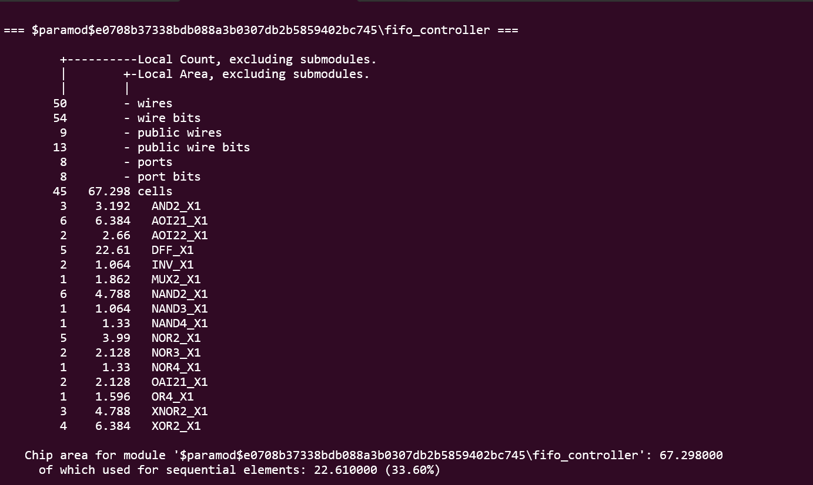
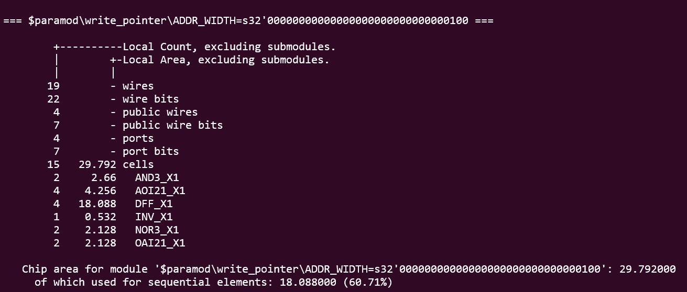
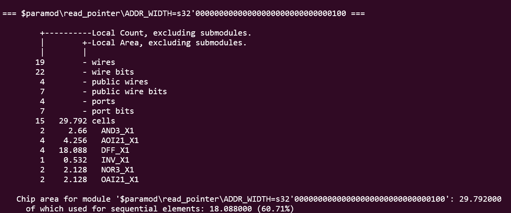
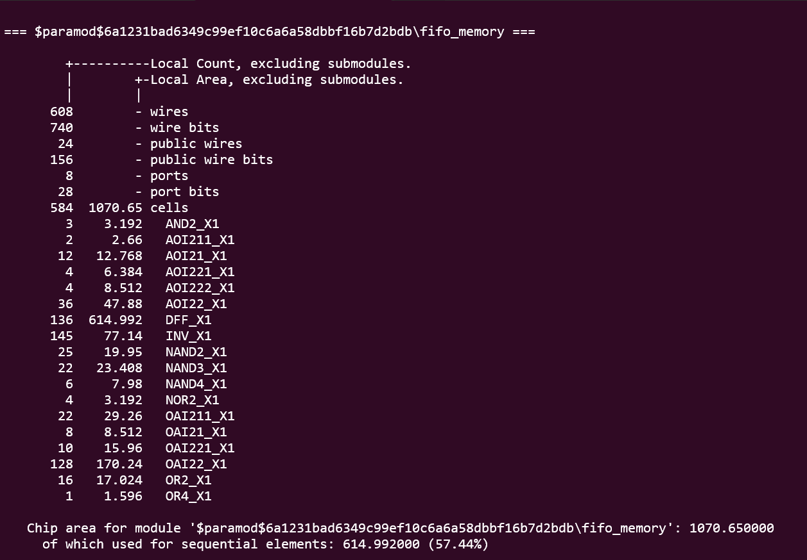

# Logic Synthesis

## Overview

The RTL design of the parameterized Synchronous FIFO was synthesized using **Yosys** with the **Nangate45 standard cell library**. The synthesis process translated the Verilog RTL into a technology-mapped gate-level netlist while optimizing the design for area.

---

## Files

| File | Description |
|------|-------------|
| `logic_synthesis.tcl` | Yosys synthesis script that reads the RTL modules, sets the top module, performs optimization, maps the design to the Nangate45 standard cell library, generates synthesis statistics, and produces the technology-mapped gate-level netlist (`fifo_synthesized.v`). |
| `fifo_synthesized.v` | Technology-mapped gate-level Verilog netlist generated after logic synthesis. |

---

## Synthesis Script

**`logic_synthesis.tcl`**

The synthesis script automates the RTL-to-gate-level synthesis flow by performing the following steps:

- Reads the Verilog RTL modules.
- Defines `fifo_top` as the top-level module.
- Converts RTL processes into logic.
- Optimizes the design by removing redundant logic and performing resource sharing.
- Maps combinational and sequential logic to the Nangate45 standard cell library.
- Generates area statistics for the synthesized design.
- Writes the technology-mapped gate-level netlist as `fifo_synthesized.v`.

---

## Synthesis Results

- RTL successfully synthesized into a technology-mapped gate-level netlist.
- All FIFO submodules were synthesized without errors.
- Area reports were generated for each module and the complete design.
- The synthesized netlist is ready for Static Timing Analysis (STA).

### Total Chip Area

| Module | Area |
|--------|------:|
| FIFO Controller | 67.298 |
| Write Pointer | 29.792 |
| Read Pointer | 29.792 |
| FIFO Memory | 1070.650 |
| **Top Module** | **1197.532** |

---

## Statistics and Area Reports

### Top Module

  

### FIFO Controller

  

### Write Pointer

  

### Read Pointer

  

### FIFO Memory

  

---

## Conclusion

The logic synthesis stage completed successfully, producing a technology-mapped gate-level netlist for the synchronous FIFO. Area analysis indicates that the FIFO memory occupies the largest portion of the design, while the controller and pointer modules contribute a comparatively smaller area. The synthesized design is ready for the subsequent Static Timing Analysis (STA) stage.
