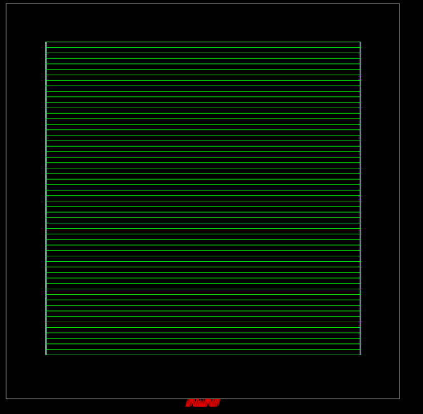
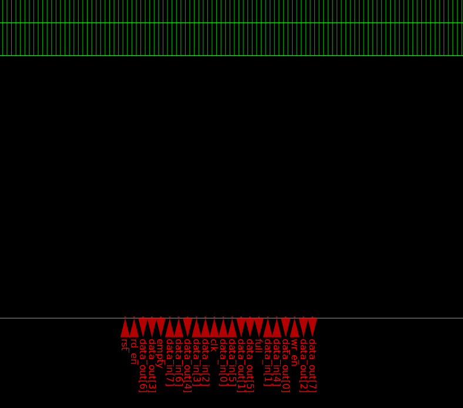
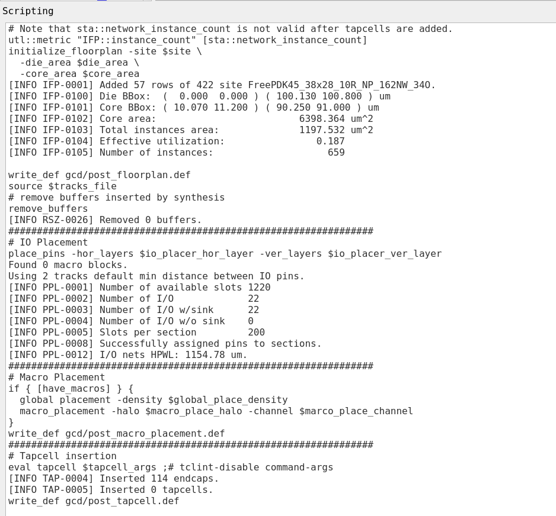
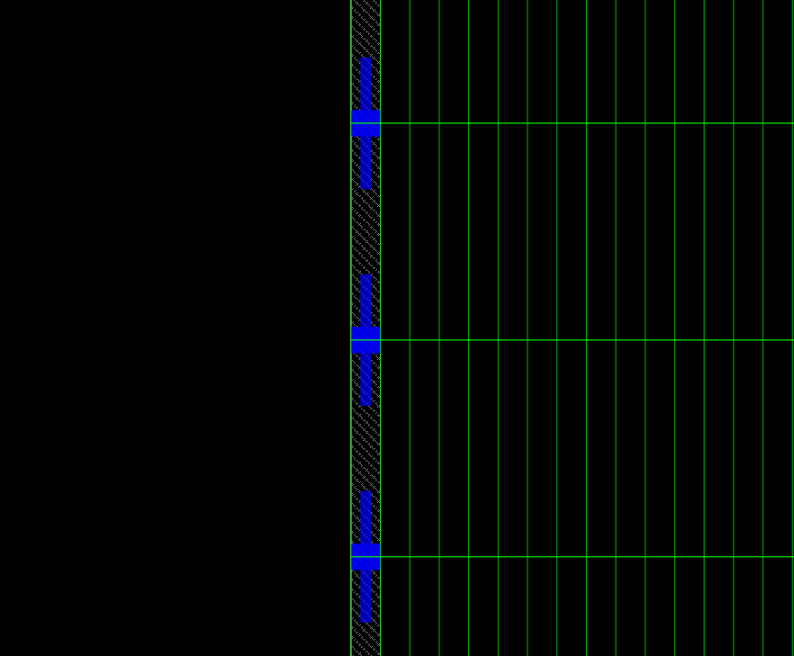

# Floorplanning using OpenROAD

## Overview

This Folder implements the **Floorplanning** stage of the RTL-to-GDSII physical design flow using **OpenROAD**. Floorplanning converts the synthesized gate-level netlist into an initial physical layout by defining the die and core regions, generating standard-cell rows, placing I/O pins, and inserting endcaps/tapcells. The output of this stage is a **DEF (Design Exchange Format)** file that serves as the input for the Placement stage.

---

## Objectives

- Define the die and core dimensions.
- Generate standard-cell placement rows.
- Automatically place I/O pins.
- Insert endcaps and tapcells.
- Generate DEF files for the next stage of physical design.

---

## Tools Used

- OpenROAD
- TCL Scripting
- Nangate45 / FreePDK45 Technology Library

---

## Input Files

| File | Description |
|------|-------------|
| Synthesized Verilog | Gate-level netlist generated after logic synthesis |
| `.lef` | Technology and standard-cell physical library |
| `.lib` | Standard-cell timing library |
| `.sdc` | Timing constraints |
| `flow_floorplan.tcl` | Main OpenROAD floorplanning script |
| `gcd_nangate45.tcl` | Technology/platform configuration script |

---

# Design Flow

```
Synthesized Netlist
        │
        ▼
Read Libraries & Constraints
        │
        ▼
Initialize Floorplan
        │
        ▼
Generate Standard Cell Rows
        │
        ▼
Automatic I/O Pin Placement
        │
        ▼
Macro Placement (If Present)
        │
        ▼
Tapcell & Endcap Insertion
        │
        ▼
Generate DEF Files
```

---

# TCL Scripts

## 1. flow_floorplan.tcl

This is the primary OpenROAD script that executes the floorplanning flow.

### Responsibilities

- Reads synthesized netlist and technology libraries
- Applies timing constraints
- Initializes die and core areas
- Generates placement rows
- Removes unnecessary synthesis buffers
- Places I/O pins automatically
- Performs macro placement (if required)
- Inserts tapcells and endcaps
- Generates intermediate and final DEF files

---

## 2. gcd_nangate45.tcl

This script contains technology-specific configuration parameters required during floorplanning.

### Responsibilities

- Defines Nangate45 technology settings
- Specifies standard-cell site information
- Defines die and core dimensions
- Configures routing layers
- Sets placement density
- Defines macro halo and channel spacing
- Configures I/O placement layers
- Stores platform-specific floorplanning parameters

---

# Floorplanning Results

| Parameter | Value |
|-----------|-------|
| Die Size | 100.130 µm × 100.800 µm |
| Core Area | 6398.364 µm² |
| Total Cell Area | 1197.532 µm² |
| Effective Utilization | 18.7% |
| Standard Cell Rows | 57 |
| Number of Instances | 659 |
| Total I/O Pins | 22 |
| Endcaps Inserted | 114 |
| Tapcells Inserted | 0 |

---

# Output Files

| File | Description |
|------|-------------|
| `post_floorplan.def` | Floorplan after initialization |
| `post_macro_placement.def` | Floorplan after macro placement |
| `post_tapcell.def` | Final floorplan after tapcell insertion |

---

# Results
## Floorplan
The generated floorplan showing the die boundary, core region, and standard-cell placement rows.

<p align="center">

</p>

## I/O Pin Placement
Automatic placement of all input and output ports along the chip boundary.

<p align="center">

</p>

## Floorplanning Execution
Console output showing floorplan initialization, utilization, I/O placement, and tapcell insertion.

<p align="center">

</p>

## Tapcell and Endcap Insertion
Visualization after endcap insertion around the design boundary.

<p align="center">

</p>

---

# Key Achievements

- Successfully initialized the die and core regions.
- Generated **57** standard-cell placement rows.
- Achieved an effective core utilization of **18.7%**.
- Automatically placed all **22** I/O pins.
- Successfully inserted **114 endcaps**.
- Generated DEF files required for the Placement stage.

---

# Conclusion

The floorplanning stage successfully established the initial physical layout of the synthesized design using OpenROAD. The design was configured with appropriate die and core dimensions, standard-cell rows were generated, all I/O pins were placed automatically, and endcaps were inserted to satisfy physical design requirements. The generated DEF files provide the necessary physical information for the subsequent Placement stage, making this an essential milestone in the RTL-to-GDSII implementation flow.
