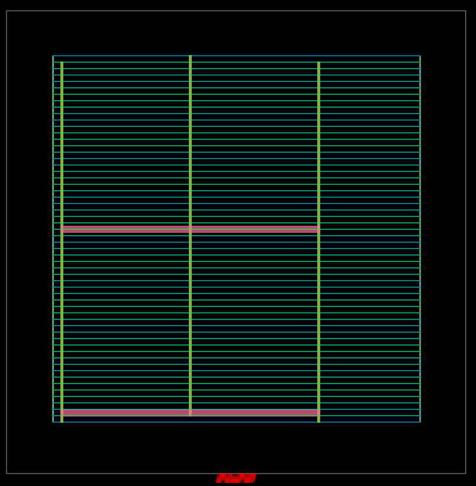
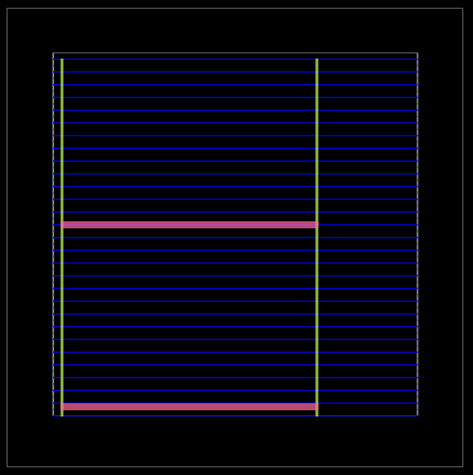
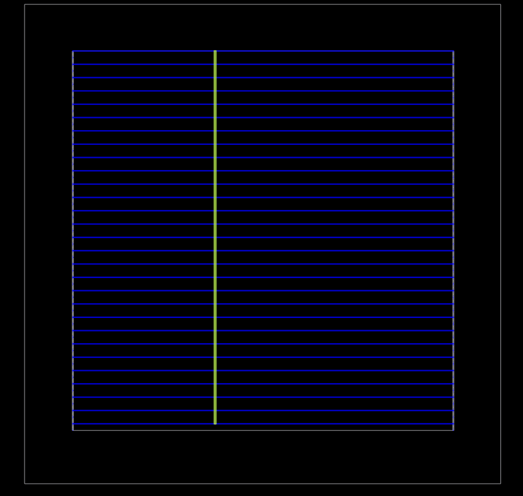
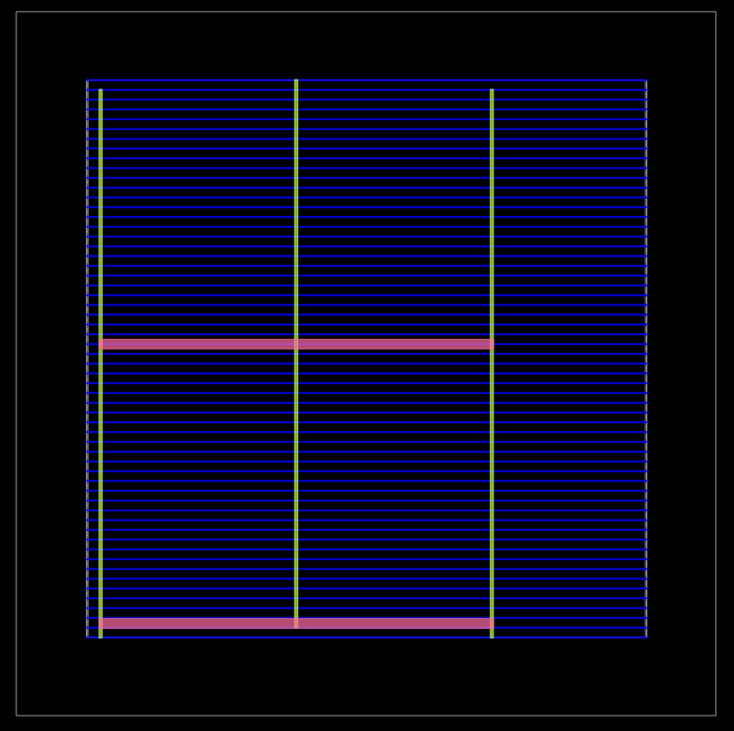

# Power Distribution Network (PDN) Generation

## Overview

After completing floorplanning, IO placement, macro placement (if present), and tap cell insertion, the next stage in the physical design flow is **Power Distribution Network (PDN) generation**.

The purpose of this stage is to build a robust power delivery network that distributes **VDD (power)** and **VSS (ground)** uniformly throughout the chip so that every standard cell receives a stable power supply.

In this project, PDN generation is performed using **OpenROAD's `pdngen`** command.

---

# Objective

- Create a reliable power distribution network.
- Generate VDD and GND rails across the design.
- Connect all standard cell rows to the power network.
- Prepare the design for detailed placement and routing.
- Minimize IR drop and improve power integrity.

---

# TCL Scripts

## `gcd_nangate45.tcl`

This is the top-level OpenROAD script.

### Purpose

- Defines the design name.
- Specifies synthesized Verilog netlist.
- Loads timing constraints (SDC).
- Defines die and core dimensions.
- Invokes the complete PDN flow.

### Key Parameters

```tcl
set design "Synchronous_FIFO"
set top_module "fifo_top"

set synth_verilog "/home/yuvapunnam/fifo_synthesized.v"

set sdc_file "gcd_nangate45.sdc"

set die_area {0 0 100.13 100.8}

set core_area {10.07 11.2 90.25 91}

include -echo "flow_pdn.tcl"
```

---

## `flow_pdn.tcl`

This script executes the physical design stages up to PDN generation.

### Major Operations

- Read technology libraries
- Read synthesized Verilog
- Link the design
- Read timing constraints
- Initialize floorplan
- Place IO pins
- Perform macro placement (if macros exist)
- Insert tap cells
- Generate the Power Distribution Network
- Export DEF files after each stage

The PDN is generated using:

```tcl
source $pdn_cfg
pdngen
```

---

# DEF Files Generated

| DEF File | Description |
|----------|-------------|
| `post_floorplan.def` | Floorplan after die/core initialization |
| `post_macro_placement.def` | Design after macro placement |
| `post_tapcell.def` | Layout after tap cell insertion |
| `post_pdn.def` | Layout after complete PDN generation |

---

# Visualization of PDN Generation

## 1. Die and Standard Cell Rows and PDN 

At the beginning, the floorplan contains only the die area and standard cell rows where cells will be placed later.

<p align="center">

</p>

---

## 2. Ground (VSS) Stripes

Ground stripes are generated vertically to distribute the ground supply across the entire core.

<p align="center">

</p>


- Vertical green stripes represent the **Ground (VSS)** network.
- Ground is distributed uniformly across the design.
- Standard cell rows will later connect to these stripes through local rails and vias.

---

## 3. Power (VDD) Stripes

Power stripes are added to distribute the positive supply voltage.

<p align="center">

</p>


- Additional vertical stripes carry **VDD**.
- Power and Ground are arranged with proper spacing to satisfy design rules.
- The network ensures low-resistance current paths across the chip.

---

## 4. Complete Power Distribution Network

The final PDN combines both VDD and VSS networks.

<p align="center">

</p>


- Both **Power (VDD)** and **Ground (VSS)** networks are now available.
- Every standard cell row has access to stable power rails.
- The design is now prepared for placement and routing.
- This improves power integrity and helps reduce voltage drop (IR drop).

---

# Why PDN Generation is Important

A well-designed PDN is essential because it:

- Supplies stable power to every standard cell.
- Reduces IR drop across the chip.
- Minimizes electromigration risk.
- Improves overall chip reliability.
- Supports higher operating frequencies by maintaining stable supply voltage.
- Forms the foundation for successful placement, clock tree synthesis, and routing.

---

# Output of This Stage

After completing PDN generation:

- ✔ Floorplan is finalized.
- ✔ IO pins are placed.
- ✔ Tap cells are inserted.
- ✔ VDD and VSS networks are created.
- ✔ `post_pdn.def` is generated.
- ✔ The design is ready for **Global Placement**.

---

# Conclusion

The Power Distribution Network (PDN) generation stage establishes the chip's power infrastructure by creating dedicated VDD and VSS networks across the core area. Using OpenROAD's `pdngen`, the design transitions from a floorplanned layout to a power-aware physical implementation. A robust PDN ensures reliable power delivery, reduces IR drop, and provides the necessary foundation for accurate placement, clock tree synthesis, and routing in the subsequent stages of the RTL-to-GDSII flow.
