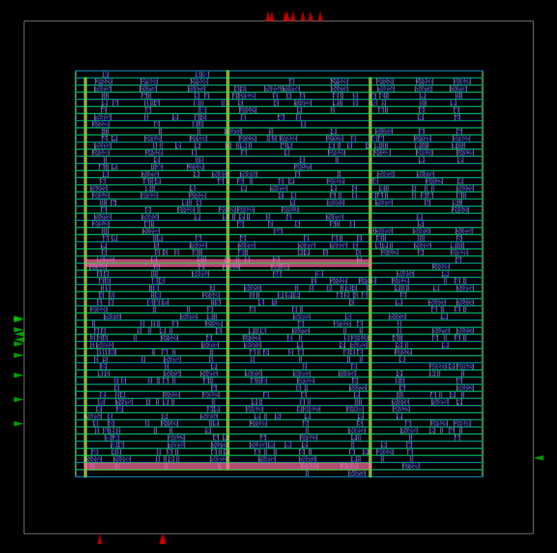
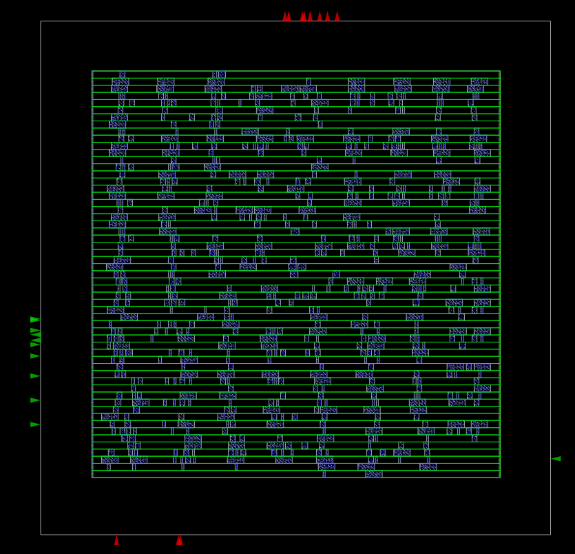
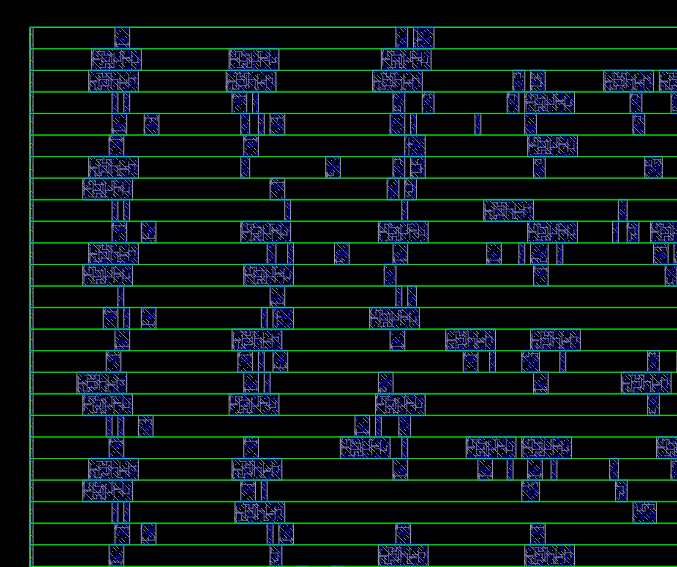

# Detailed Placement using OpenROAD

## Project Overview

This stage implements **Detailed Placement** for the synthesized **Synchronous FIFO** design using the **OpenROAD** physical design flow and the **Nangate45** standard cell library.

Detailed placement is performed after Global Placement to convert the coarse placement into a **legal placement**. During this stage, every standard cell is aligned to valid standard cell rows, overlaps are removed, and all placement constraints are satisfied while preserving the optimized wirelength and timing obtained during global placement.

---

# Flow Overview

The Detailed Placement stage performs the following operations:

```
Global Placement DEF
        │
        ▼
Detailed Placement
        │
        ▼
Legalize Standard Cells
        │
        ▼
Remove Cell Overlaps
        │
        ▼
Align Cells to Placement Sites
        │
        ▼
Improve Local Wirelength
        │
        ▼
Check Placement Legality
        │
        ▼
Write DEF
        │
        ▼
Write Updated Netlist
```

---

# TCL Files

## 1. `gcd_nangate45.tcl`

This is the top-level configuration script.

### Responsibilities

- Loads Nangate45 technology files
- Specifies the synthesized Verilog netlist
- Defines the top module
- Reads SDC timing constraints
- Specifies DEF input/output files
- Calls the Detailed Placement flow

---

## 2. `flow_detailed_placement.tcl`

This script performs legalization and optimization after global placement.

### Main Steps

### Read Design

- Read technology libraries
- Read synthesized Verilog
- Link the design
- Read timing constraints
- Load the Global Placement DEF

---

### Detailed Placement

The OpenROAD command

```
detailed_placement
```

performs:

- Cell legalization
- Row alignment
- Site alignment
- Removal of overlapping cells
- Small local optimizations
- Whitespace utilization

---

### Placement Verification

The script checks whether:

- Every standard cell is placed on legal placement sites.
- Cells do not overlap.
- Placement satisfies technology rules.
- Cell orientation matches row orientation.

---

### Output Generation

The script generates:

```
post_detailed_placement.def
```

and an updated placed Verilog netlist

```
post_detailed_placement.v
```

The resulting DEF contains the legal coordinates of every placed standard cell.

---

# Results

## 1. Detailed Placement Layout

<p align="center">

</p>

Observations

- All standard cells are legalized.
- Cells are aligned to standard cell rows.
- No overlapping cells are visible.
- Placement is ready for the next physical design stage.

---

## 2. Standard Cell Placement

<p align="center">

</p>

The image shows that:

- Standard cells occupy legal placement rows.
- Uniform spacing exists between neighboring rows.
- Cell orientations follow alternating row directions (N/FS).
- The placement is significantly cleaner than Global Placement.

---

## 3. Zoomed View

<p align="center">

</p>

The zoomed image clearly illustrates:

- Every standard cell is snapped to the placement sites.
- Cells are perfectly aligned with the green standard cell rows.
- No overlaps or illegal placements remain.
- This legal placement is suitable for Clock Tree Synthesis (CTS).

---

# Difference Between Global Placement and Detailed Placement

| Global Placement | Detailed Placement |
|-----------------|-------------------|
| Approximate cell locations | Legal cell locations |
| Cells may overlap | Overlaps removed |
| Cells are not aligned to rows | Cells aligned to standard cell rows |
| Focus on wirelength optimization | Focus on legalization and manufacturability |
| Ready for legalization | Ready for CTS |

---

# Output Files

| File | Description |
|------|-------------|
| `post_detailed_placement.def` | Legalized placement database |
| `post_detailed_placement.v` | Updated placed netlist |
| Placement database | Used for Clock Tree Synthesis |

---

# Conclusion

The Detailed Placement stage successfully legalized the placement of the **Synchronous FIFO** design. Standard cells were aligned to the predefined placement sites, overlaps were eliminated, and the layout now satisfies the physical constraints of the Nangate45 technology. Compared with the Global Placement stage, the placement is now fully legal and manufacturable. The generated `post_detailed_placement.def` and `post_detailed_placement.v` files provide the finalized placement database that will be used as the input for the next stage of the OpenROAD flow, **Clock Tree Synthesis (CTS)**.
