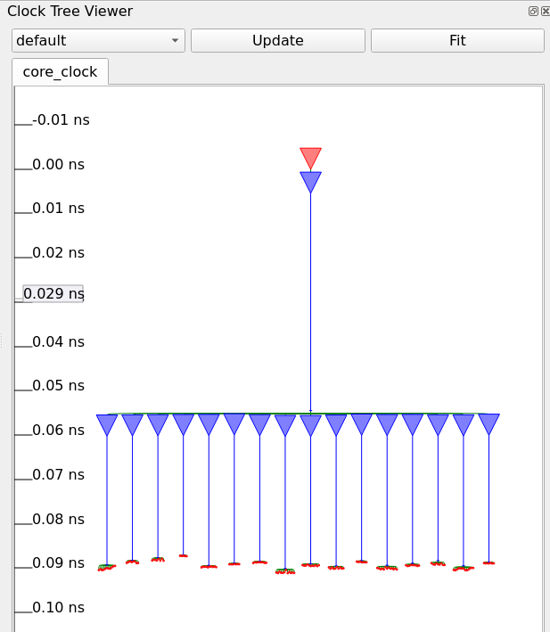
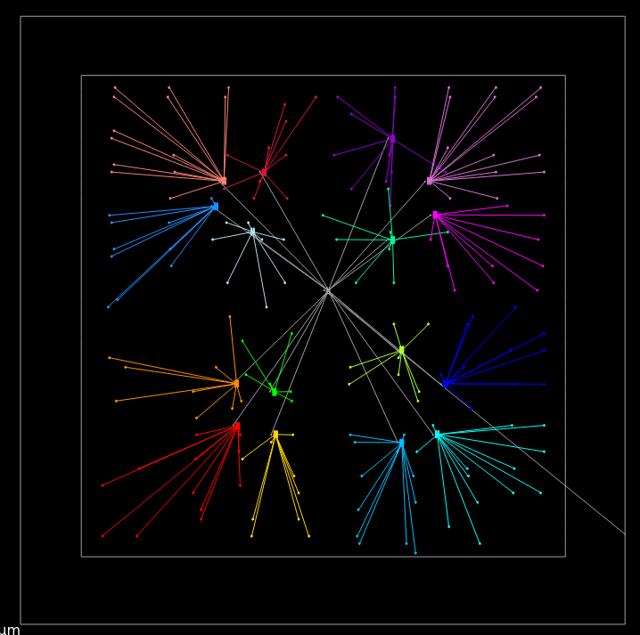
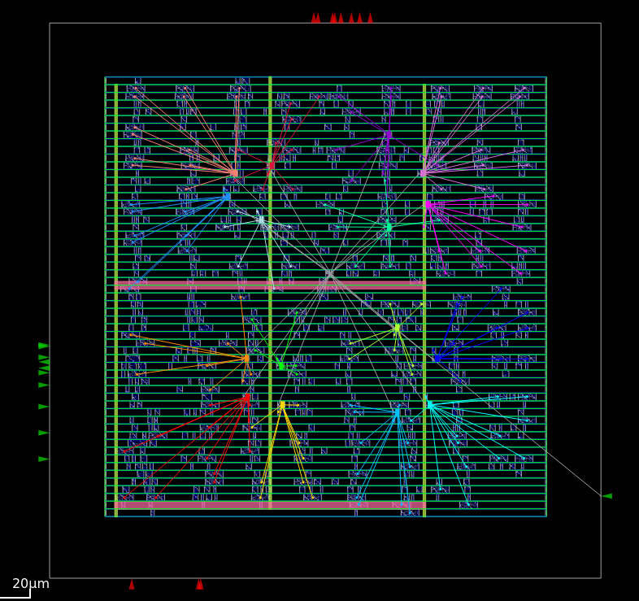

# Clock Tree Synthesis (CTS)

## Overview

Clock Tree Synthesis (CTS) is performed after global placement to distribute the clock signal from the clock source to all sequential elements while minimizing clock skew, insertion delay, and clock latency. During this stage, OpenROAD inserts clock buffers/inverters and constructs a balanced clock tree.

---

## Objectives

- Build a balanced clock distribution network.
- Minimize clock skew between all clock sinks.
- Reduce clock insertion delay.
- Meet timing requirements for setup and hold analysis.
- Control clock transition and fanout.

---

## CTS Script

The CTS flow is implemented using the Tcl script:

```
flow_CTS.tcl
```

The script performs:

- Reading LEF, Liberty, DEF and Verilog files
- Loading SDC constraints
- Configuring CTS options
- Running Clock Tree Synthesis
- Legalization after CTS
- Timing analysis
- Writing output DEF and Verilog files

---

## Output Files

| File | Description |
|------|-------------|
| `post_CTS.def` | DEF file after Clock Tree Synthesis |
| `post_CTS.v` | Gate-level netlist after CTS |
| `Clock_Tree_Synthesized.png` | Physical clock tree generated after CTS |
| `Clock_Tree.png` | Clock Tree Viewer showing clock hierarchy |
| `Die.png` | Chip layout after CTS |

---

# Clock Tree Viewer

The Clock Tree Viewer displays the logical structure of the generated clock tree.

<p align="center">

</p>

### Observation

- A single clock source drives the entire clock network.
- Multiple clock buffers are inserted automatically.
- Clock sinks are reached through balanced branches.
- The tree exhibits a nearly symmetric structure, reducing clock skew.
- Clock insertion delay is approximately **0.09 ns** from the root to the sinks.

---

# Synthesized Clock Tree

The synthesized clock tree generated by OpenROAD is shown below.

<p align="center">

</p>

### Observation

- The clock source is located near the center of the design.
- Clock buffers are distributed hierarchically.
- Different colors represent different clock tree branches.
- Buffers are placed close to groups of sequential elements to reduce wire delay.
- The clock network is balanced across the design.

---

# Die After Clock Tree Synthesis

The complete chip layout after CTS is shown below.

<p align="center">

</p>

### Observation

- Standard cells remain legally placed after CTS.
- Additional clock buffers are inserted into the layout.
- Clock routing connects all sequential elements.
- The design remains well distributed across the core area.
- CTS preserves placement quality while improving clock distribution.

---

# Benefits of CTS

- Reduced clock skew
- Balanced clock arrival time
- Improved setup timing
- Better hold timing
- Controlled clock latency
- Reliable clock distribution across the chip

---

## Next Stage

The next step in the RTL-to-GDSII flow is:

```
Clock Tree Synthesis
        ↓
Global Routing
        ↓
Detailed Routing
        ↓
Parasitic Extraction
        ↓
Static Timing Analysis
```

---

## Conclusion

Clock Tree Synthesis successfully generated a balanced clock network by inserting clock buffers and distributing the clock signal to all sequential elements. The resulting clock tree minimizes clock skew and insertion delay while maintaining legal placement, preparing the design for the routing stage.
