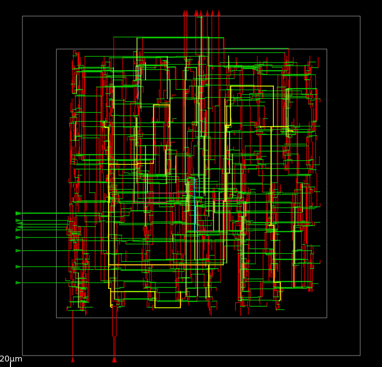
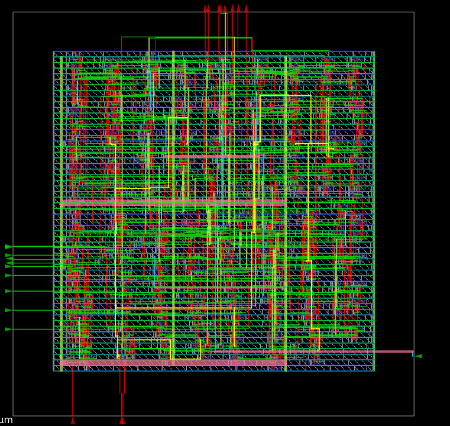
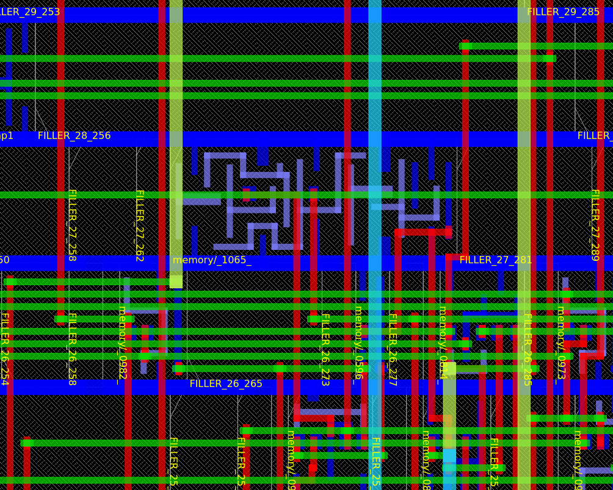
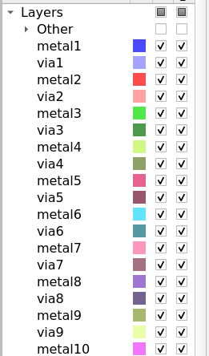

# Routing

## Overview

Routing is the stage of the physical design flow where all signal, clock, and power nets are physically connected using the available metal layers and vias. In this flow, OpenROAD performs **Global Routing**, **Antenna Repair**, **Detailed Routing**, and **Filler Cell Placement** before exporting the final routed DEF and Verilog files.

---

# Routing Flow

The routing flow implemented in `flow_routing.tcl` consists of the following major stages:

```
Read Design
      │
      ▼
Pin Access Analysis
      │
      ▼
Global Routing
      │
      ▼
Antenna Repair
      │
      ▼
Detailed Routing
      │
      ▼
Antenna Repair (Post DRT)
      │
      ▼
Routing Verification
      │
      ▼
Filler Cell Placement
      │
      ▼
Write Routed DEF & Verilog
```

---

# Routing Script

Routing is performed using

```
flow_routing.tcl
```

The routing section of the script executes the following commands.

---

# Output Files

| File | Description |
|-------|-------------|
| post_routing.def | Routed DEF |
| post_routing.v | Routed Gate-Level Netlist |
| Routing.png | Routed Design |
| Die.png | Routed Layout |
| Zoomed_Routing.png | Zoomed Routing View |
| Metal_Layers.png | Metal Layer Utilization |

---

# Routed Layout

<p align="center">

</p>

### Observation

- All signal nets are completely routed.
- Horizontal and vertical routing tracks are visible.
- Multiple routing layers are used.
- Clock, signal, and power nets are interconnected.
- Congestion is effectively managed.

---

# Complete Routed Die

<p align="center">

</p>

### Observation

- The entire core is routed successfully.
- Routing covers the complete placement area.
- Standard cells remain legally placed.
- External I/O pins are connected to internal logic.

---

# Zoomed Routing View

<p align="center">

</p>

### Observation

- Individual metal wires are clearly visible.
- Multiple vias connect adjacent routing layers.
- Pins are connected through legal routing paths.
- Routing follows the technology design rules.

---

# Metal Layer Utilization

<p align="center">

</p>

---

# Features of the Routing Flow

- Pin Access Analysis
- Global Routing
- Congestion-aware Routing
- Routing Guide Generation
- Antenna Repair
- Detailed Routing
- DRC Generation
- Maze Routing
- Routing Verification
- Filler Cell Placement
- Routed DEF Generation
- Routed Verilog Generation

---

# Conclusion

The routing flow successfully completes the physical interconnection of all signal and clock nets. The script performs global routing, antenna repair, detailed routing, post-route verification, and filler cell insertion before exporting the final routed DEF and Verilog files. The routed design is now ready for **parasitic extraction (SPEF generation), post-route Static Timing Analysis (STA), and final GDSII generation**.
