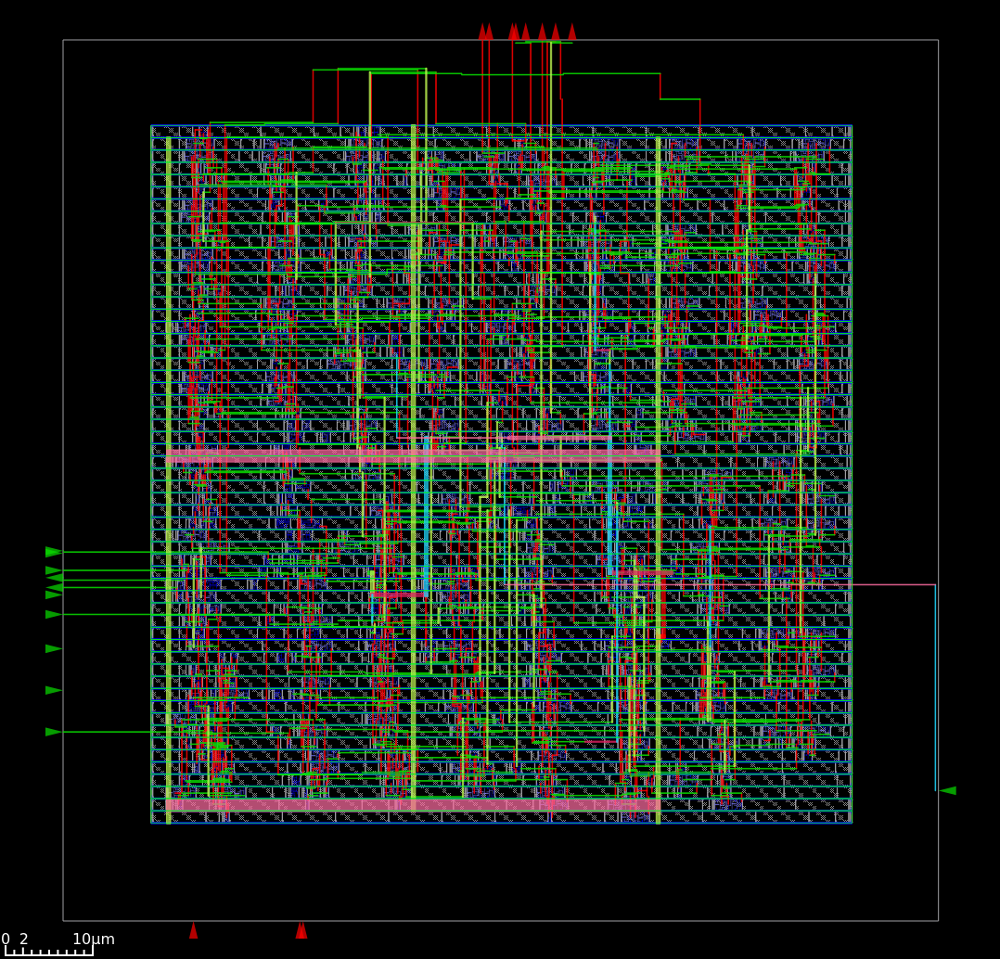

# RTL-to-GDSII Implementation of a Parameterized Synchronous FIFO

## Overview
This repository presents the complete RTL-to-GDSII implementation of a parameterized Synchronous FIFO using open-source ASIC design tools. The project demonstrates the digital ASIC design flow, starting from RTL design in Verilog and progressing through logic synthesis, static timing analysis, floorplanning, placement, clock tree synthesis, routing, and GDSII generation.

The objective of this project is to understand and implement the complete front-end and back-end ASIC design flow while analyzing timing, area, and physical design results.

---

## Design Specifications

| Parameter | Value |
|-----------|-------|
| FIFO Type | Synchronous |
| Data Width | 8-bit |
| FIFO Depth | 16 |
| Address Width | 4 |

---

## RTL-to-GDSII Flow

1. RTL Design
2. Functional Simulation
3. Logic Synthesis (Yosys)
4. Static Timing Analysis (OpenSTA)
5. Floorplanning
6. Placement
7. Clock Tree Synthesis
8. Routing
9. Physical Verification
10. GDSII Generation

---

## Tools Used

- Verilog HDL
- GTKWave
- Yosys
- OpenSTA
- OpenROAD
- Nangate45 Open Cell Library

---

## Repository Structure

```
rtl-to-gds-synchronous-fifo/
│
│   ├── gcd_nangate.sdc
|
├── 01_RTL_Design/
│   ├── fifo.v
│   ├── write_pointer.v
│   ├── read_pointer.v
│   ├── memory_array.v
│   └── top.v
│
├── 02_Functional_Verification/
│   ├── fifo_tb.v
│   └── simulation_results/
│
├── 03_Logic_Synthesis/
│   ├── logic_synthesis.tcl
│   ├── fifo_synthesized.v
│   └── reports/
│
├── 04_Timing_Power_Analysis/
│   ├── timing_power.sdc
│   ├── timing_power_check.tcl
│   └── reports/
│
├── 05_Floorplanning/
│   ├── images/
│   ├── README.md
│   ├── flow_floorplan.tcl
│   ├── gcd_nangate45.tcl
│   ├── post_floorplan.def
│   ├── post_macro_placement.def
│   └── post_tapcell.def
│
├── 06_Power_Distribution_Network/
│   ├── images/
│   ├── README.md
│   ├── flow_pdn.tcl
│   ├── gcd_nangate45.tcl
│   └── post_pdn.def
│
├── 07_Global_Placement/
│   ├── images/
│   ├── README.md
│   ├── flow_global_placement.tcl
│   ├── gcd_nangate45.tcl
│   └── post_global_placement.def
│
├── 08_Detailed_placement/
│   ├── images/
│   ├── README.md
│   ├── flow_detailed_placement.tcl
│   ├── gcd_nangate45.tcl
│   ├── post_detailed_placement.def
│   └── post_detailed_placement.v
│
├── 09_CTS/
│   ├── images/
│   ├── README.md
│   ├── flow_CTS.tcl
│   ├── gcd_nangate45.tcl
│   ├── post_CTS.def
│   └── post_CTS.v
├── 10_Routing/
│   ├── images/
│   ├── README.md
│   ├── flow_routing.tcl
│   ├── gcd_nangate45.tcl
│   ├── post_routing.def
│   └── post_routing.v
├── 11_GDSII/
│   ├── README.md
│   ├── design.v
│   ├── design.spef
│   ├── design.obd
│   ├──design.def
|   └── Reports
|
└── README.md
```

---

## Results

- RTL Simulation
- Synthesis Reports
- Timing Reports
- Floorplan
- Placement
- CTS
- Routing
- Final Layout (GDSII)
Results for each step are included in respective folders

---

# Final Layout

The figure below shows the final routed layout after completing the entire RTL-to-GDSII flow.

<p align="center">

</p>

The layout includes:

- Standard cell placement
- Clock tree
- Multi-layer routing
- Signal interconnections
- Power rails
- Via connections
- Filler cells
- Post-route optimized layout

---

# Final Design Summary

| Parameter | Result |
|-----------|--------|
| Clock Name | core_clock |
| Clock Period | **0.5 ns** |
| Design Area | **1336 µm²** |
| Core Utilization | **21%** |
| Worst Hold Slack | **0.011 ns (MET)** |
| Worst Setup Slack | **0.002 ns (MET)** |
| Total Negative Slack (TNS) | **0.000 ns** |
| Setup Clock Skew | **0.003 ns** |
| Total Power | **5.30 mW** |

---

# Power Breakdown

| Component | Total Power |
|-----------|-------------|
| Sequential Logic | **2.34 mW** |
| Combinational Logic | **1.28 mW** |
| Clock Network | **1.68 mW** |
| Total Power | **5.30 mW** |

---

# Timing Summary

The final Static Timing Analysis confirms that:

- Setup timing is satisfied.
- Hold timing is satisfied.
- Worst setup slack is positive.
- Worst hold slack is positive.
- Total Negative Slack (TNS) is zero.
- The design successfully meets the specified timing constraints.

---

# Conclusion

The RTL-to-GDSII flow completed successfully, producing a fully placed, clocked, and routed design that satisfies the specified timing constraints. The final implementation achieved **1336 µm²** of design area with **21% core utilization**, **0.0 ns Total Negative Slack**, **0.002 ns worst setup slack**, and **0.011 ns worst hold slack**, indicating that both setup and hold timing requirements are met. The clock network exhibits a low **0.003 ns setup skew**, while the total estimated power consumption is **5.30 mW**. The generated DEF, Verilog, ODB, SPEF, reports, timing constraints, and final layout image together provide a complete set of artifacts for post-layout verification, signoff analysis, and GDSII generation.

---

## Author

**Yuva Punnam**

B.Tech in Electronics and Communication Engineering

Interested in RTL Design, Physical Design, and ASIC Implementation.

